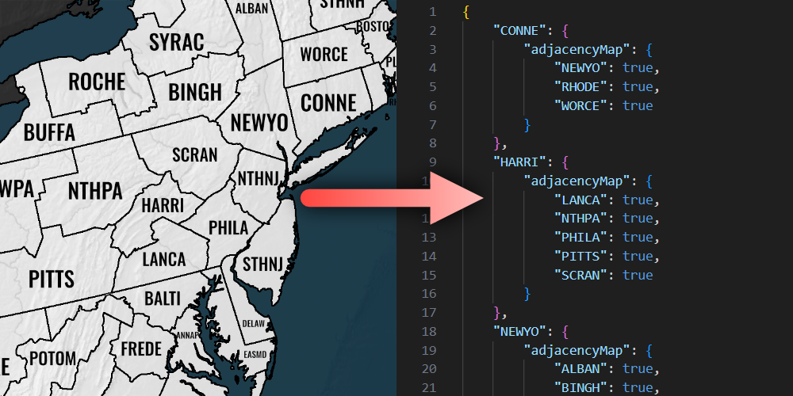

# About

This script generates a complete adjacency map from a map image through image analysis done by OpenCV, Pytesseract, and Pillow. The resulting graph is saved to a JSON file.

Please note that this is a work in progress. I wrote this to assist me with another project.




## Getting Started

### Prerequisites

Since this script utilizes Pytesseract, you need to have [Google Tesseract OCR](https://github.com/tesseract-ocr/tesseract) installed.
* The script is expecting you to have tesseract installed in C:\Program Files\ but you can change this in main.py if needed.

### Installation

1. Clone the repo.
    ```sh
   git clone https://github.com/ian-hampton/image-to-graph.git
   ```
2. Create a python virtual enviroment for this project using the provided requirements.txt file.

    1. Create the virtual enviroment.
        ```sh
        python -m venv .venv
        ```
    2. Activate the virtual enviroment.
        ```sh
        source .venv\Scripts\activate
        ```
    3. Install project requirements.
        ```sh
        pip install -r requirements.txt
        ```

## Usage

The script will take two images of your map and use them to create a graph, exported as a JSON file.
1. "map.png" - A blank image of your map with no text or other features.
2. "text.png" - An image containing all the text on your map.

## Roadmap

- [x] Add option to change bresenham circle radius.
- [ ] Make the adjacency detection more effecient.
- [ ] Improve text detection to work with a completely transparent background.
- [ ] Add additional save options?

## Contact

Ian Hampton

Project Link: https://github.com/ian-hampton/image-to-graph
